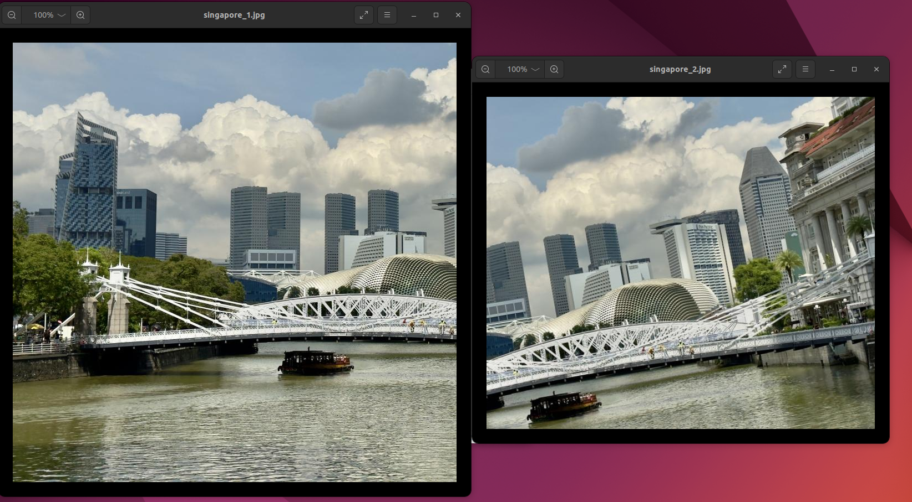
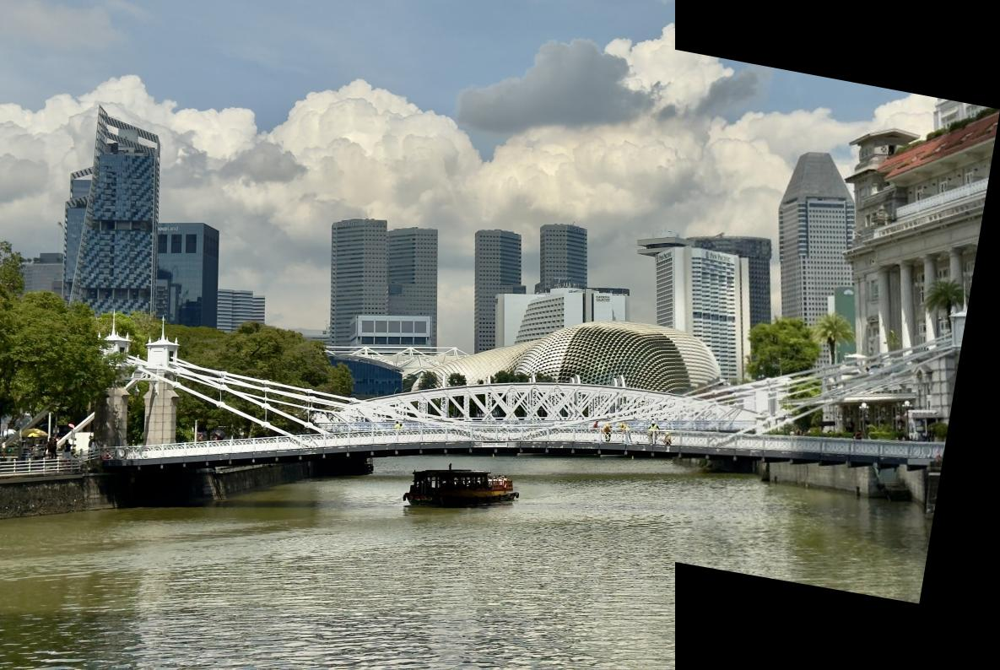
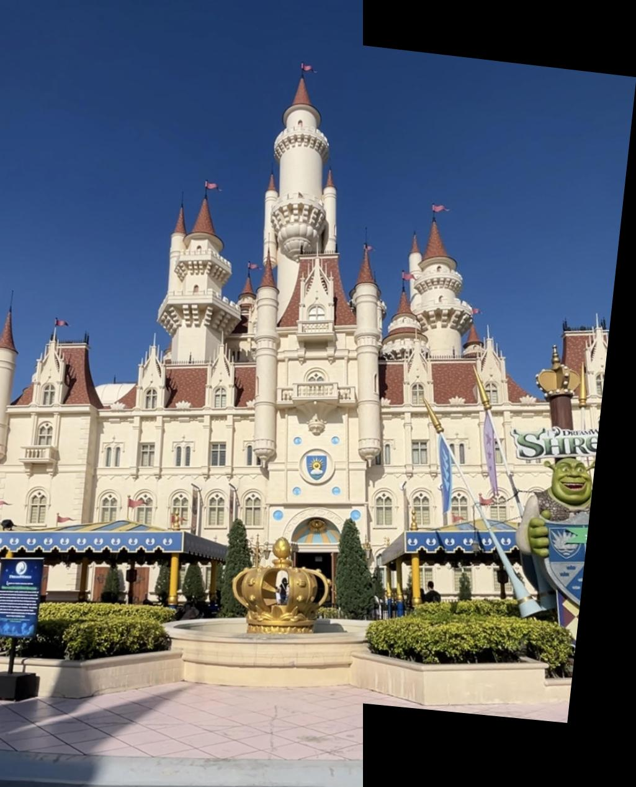
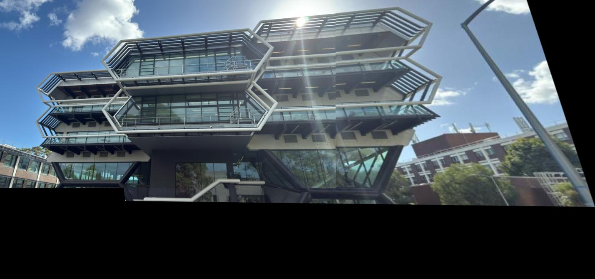

# Image Stitching from Scratch

A Computer Vision project implementing a complete image stitching pipeline from scratch using Python, NumPy, OpenCV and scikit-image.

This project was completed for **Computer Vision** at **Monash University**.

---
Origin



Final


## Overview

This project implements the classical panorama image stitching pipeline without relying on OpenCV's built-in stitching functions.

The pipeline includes:

- Harris Corner Detection
- Feature Matching
- Homography Estimation (DLT)
- RANSAC-based Outlier Rejection
- Perspective Warping
- Image Stitching

---

## Pipeline

```text
Input Images
      │
      ▼
Harris Corner Detection
      │
      ▼
Feature Matching
      │
      ▼
Homography Estimation
      │
      ▼
RANSAC
      │
      ▼
Perspective Warp
      │
      ▼
Panorama Image
```

---

## Features

- Harris corner detector implemented from scratch
- Direct Linear Transformation (DLT) for homography estimation
- Custom RANSAC implementation for robust model fitting
- Perspective image warping
- Panorama generation
- Visualization of detected corners and feature matches

---

## Project Structure

```text
Image-Stitching/
│
├── README.md
├── notebooks/
│   └── Image_stitching.ipynb
│
├── docs/
│   └── images/
│       ├── pipeline.png
│       ├── castle_result.png
│       ├── singapore_result.png
│       └── university_result.png
│
├── inputs/
│   ├── castle_1.jpg
│   ├── castle_2.jpg
│   ├── singapore_1.jpg
│   ├── singapore_2.jpg
│   ├── university_1.jpg
│   └── university_2.jpg
│
└── outputs/
    ├── stitched_castle.jpg
    ├── stitched_singapore.jpg
    └── stitched_university.jpg
```

---

## Algorithm

### 1. Harris Corner Detection

Detect salient corner features using the Harris corner response computed from image gradients.

---

### 2. Homography Estimation

Estimate the projective transformation between two images using the Direct Linear Transformation (DLT) algorithm.

---

### 3. RANSAC

Robustly estimate the homography while rejecting mismatched feature correspondences.

---

### 4. Image Stitching

Warp one image into the coordinate system of the other and blend them to generate a panorama.

---

## Example Results

### Castle



---

### Singapore


---

### University



---

## Technologies

- Python
- NumPy
- OpenCV
- scikit-image
- SciPy
- Matplotlib

---

## Skills Demonstrated

- Feature Detection
- Geometric Computer Vision
- Projective Geometry
- Robust Model Estimation
- Image Warping
- Image Registration
- Panorama Generation

---

## Future Improvements

- SIFT / ORB feature extraction
- Multi-band image blending
- Cylindrical projection
- Automatic exposure compensation
- Multi-image panorama stitching

---

## Author

**Yuan Zou**

Master of Artificial Intelligence

Monash University